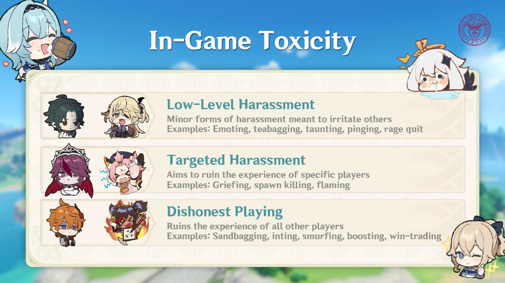
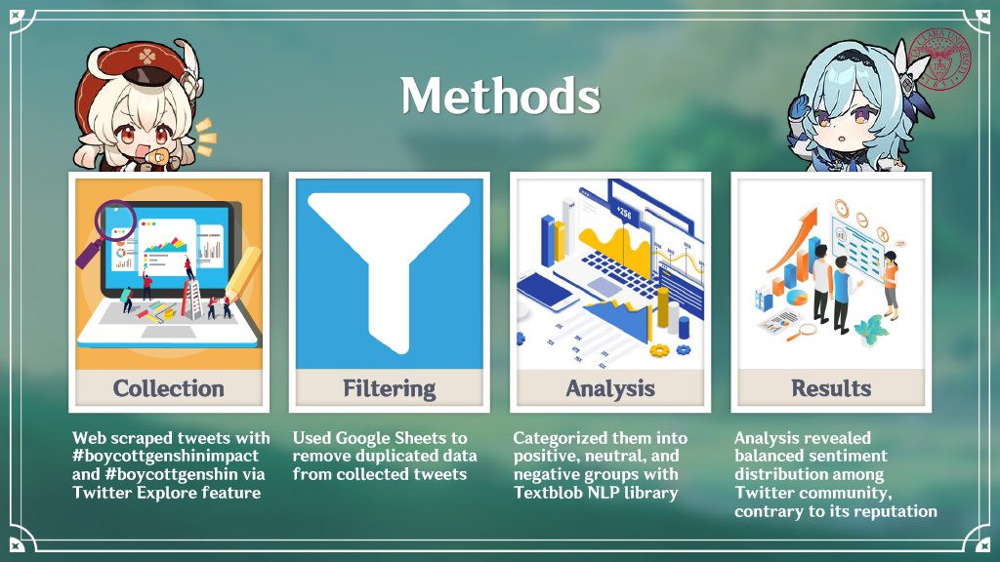
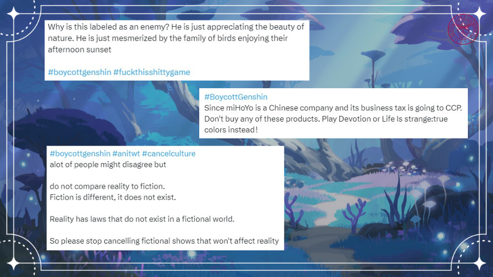

  
  
  

Toxic Impact was a research project I completed in 2023 at the Santa Clara University Media Lab. The aim was to analyse sentiment expressed by players on social media, specifically Twitter, and compare to popular discourse online surrounding the game during a matching period of time. This project consisted of scraping Twitter tweets and comments using specific keywords or tags that relate to the game of interest: Genshin Impact. Sentiment analysis was performed using the Python NLP library, TextBlob. Exploring trends, such as negative (or toxic) sentiment, in response to game developer communications and actions is a developing research topic in the field of Game Studies. It is of particular interest to game developers and publishers as differences in popular discourse and narratives of sentiment in online communities can vary wildly from actual sentiment conveyed on social media.

For this project, I was the second author who was responsible for doing background research, looking for methods to perform sentiment analysis, compiling the final version of the research paper, and creating the presentation for the International Communication Association (ICA) conference. The background research consisted of many different topics, ranging from sentiment analysis methods (primarily using Python) and reading already established research in this topic (defining toxicity, propogation of toxicity online, etc.). We submitted our paper to ICA Toronto and was accepted into the conference and invited to present our research. I created the presentation and presented our research at the conference myself.
