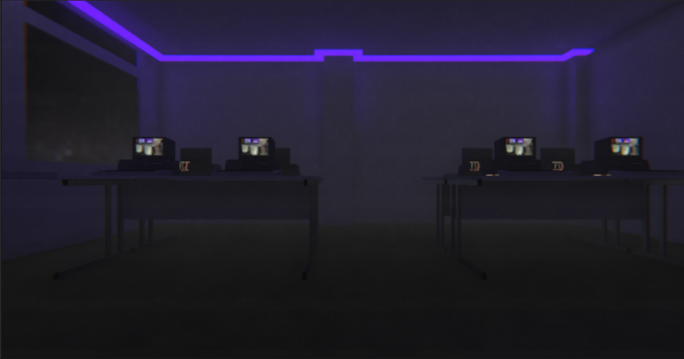
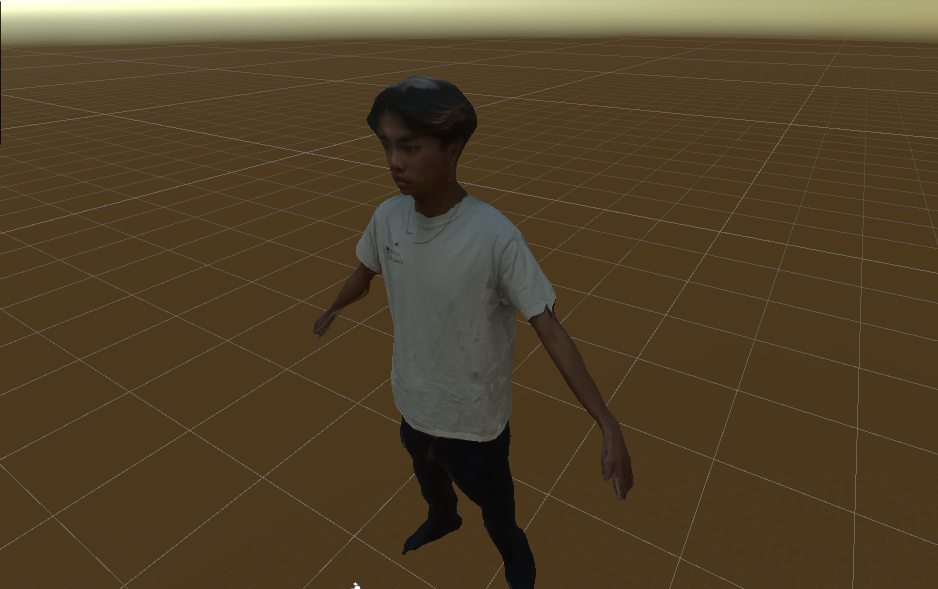

  
  

For this project, I worked with a partner to create a VR detective game demo for our final project in our VR Game Design and Development class at Santa Clara University. The premise of the game revolved around the Media Lab, which my partner and I were a part of at Santa Clara University, in which a member of our lab had kidnapped our lab mascot. In a digital recreation of the lab in Unity, the player was tasked with finding scattered clues and piecing the puzzle together in order to find the culprit out of a list of suspects (who all happened to be lab members as well). While many models were downloaded from online resources, there were also custom models that were either modeled in Blender or captured using LiDAR and photogrammetry. The entire set was created in Unity and the camera filter was done through Unity's Shader Graph.

You can learn more at https://github.com/EPICcake808/COMM-170-Final-Project
